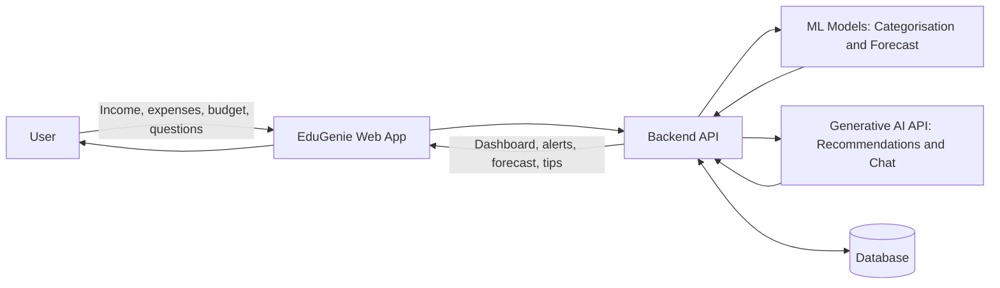

# Data Flow Diagram

**Project:** EduGenie – Your Smart Budget & Recommendation Assistant  
**Team ID:** SWTID-2026-5933

## Level 0 Data Flow

## Data Flow Description

| Flow No | Source | Data | Destination | Purpose |
|---|---|---|---|---|
| 1 | User | Login details | Backend API | Authenticate user |
| 2 | User | Income, expenses, budget limits | Backend API | Record financial data |
| 3 | Backend API | Expense description | ML Model | Predict expense category |
| 4 | Backend API | Past spending data | ML Model | Forecast next month's expenses |
| 5 | Backend API | Spending summary and question | Generative AI API | Create saving tips and chat replies |
| 6 | Backend API | Transactions and results | Database | Store user data |
| 7 | Backend API | Charts, alerts and tips | User | Display results |

## User Stories

| User Type | Functional Requirement (Epic) | User Story Number | User Story / Task | Acceptance Criteria | Priority | Release |
|---|---|---|---|---|---|---|
| User | Registration | USN-1 | As a user, I can register with name, email and password | Account is created | High | Sprint-1 |
| User | Login | USN-2 | As a user, I can log in securely | Valid credentials open the dashboard | High | Sprint-1 |
| User | Expense Tracking | USN-3 | As a user, I can add income and expenses | Entries are saved and listed | High | Sprint-2 |
| User | Auto Categorisation | USN-4 | As a user, I get my expense category suggested automatically | Category is predicted from the description | High | Sprint-2 |
| User | Budget Planner | USN-5 | As a user, I can set category budgets and receive alerts | Alert shows when 80 percent of a limit is used | High | Sprint-3 |
| User | Spending Forecast | USN-6 | As a user, I can see next month's predicted spending | Forecast is shown with a chart | Medium | Sprint-3 |
| User | AI Recommendations | USN-7 | As a user, I get personalised tips to save money | Tips match my spending categories | High | Sprint-4 |
| User | Budget Chat | USN-8 | As a user, I can ask money-related questions | Chat answers using my budget data | Medium | Sprint-4 |
