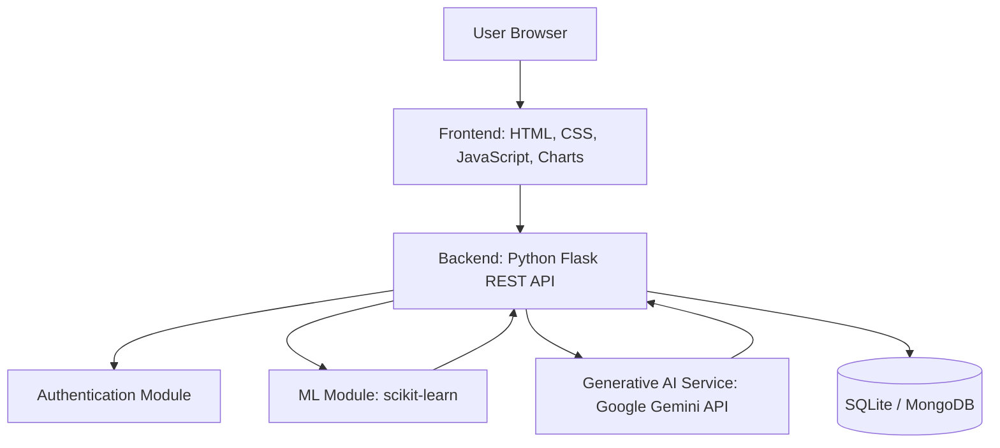

# Solution Architecture

**Project:** EduGenie – Your Smart Budget & Recommendation Assistant  
**Team ID:** SWTID-2026-5933

## Architecture Diagram

## Table 1: Components and Technologies

| S.No | Component | Description | Technology |
|---|---|---|---|
| 1 | User Interface | Dashboard, expense form, budget page, chat page | HTML, CSS, JavaScript, Chart.js |
| 2 | Application Logic 1 | REST API, validation and routing | Python, Flask |
| 3 | Application Logic 2 | Expense categorisation and spending forecast | scikit-learn, pandas |
| 4 | Application Logic 3 | Recommendations and budget chat | Google Gemini API |
| 5 | Database | Stores users, transactions, budgets and history | SQLite / MongoDB |
| 6 | Authentication | Registration and secure login | JWT, password hashing |
| 7 | Configuration | Keys and secrets kept outside code | .env file |
| 8 | Infrastructure | Local development and cloud deployment | Localhost, cloud hosting |

## Table 2: Application Characteristics

| S.No | Characteristic | Description | Technology |
|---|---|---|---|
| 1 | Open-Source Frameworks | Libraries used | Flask, scikit-learn, pandas, Chart.js |
| 2 | Security | Hashed passwords, token-based access, hidden API keys | JWT, hashing, dotenv |
| 3 | Scalable Architecture | Separate modules for API, ML and generative AI | Modular Flask design |
| 4 | Availability | Cloud hosting with automatic restart | Cloud hosting platform |
| 5 | Performance | Lightweight models and short prompts for quick responses | Optimised ML and prompts |
